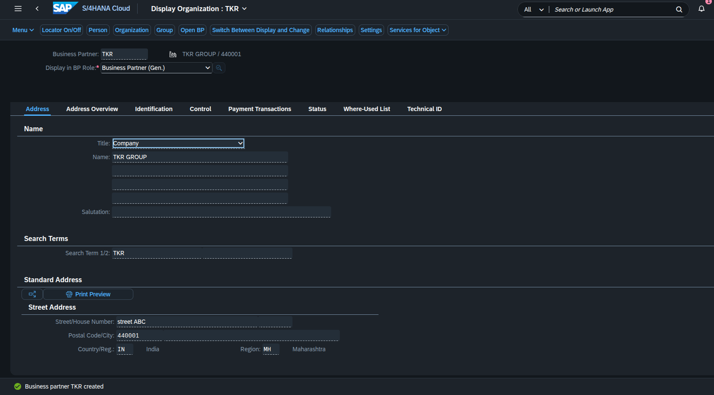
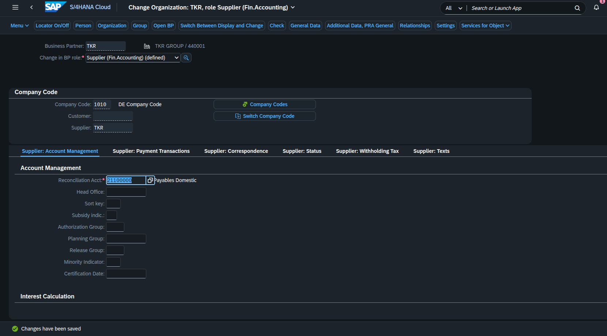
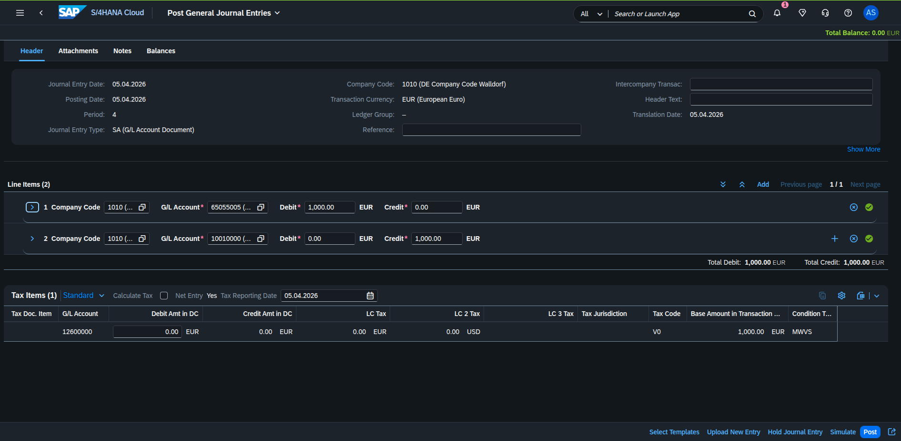
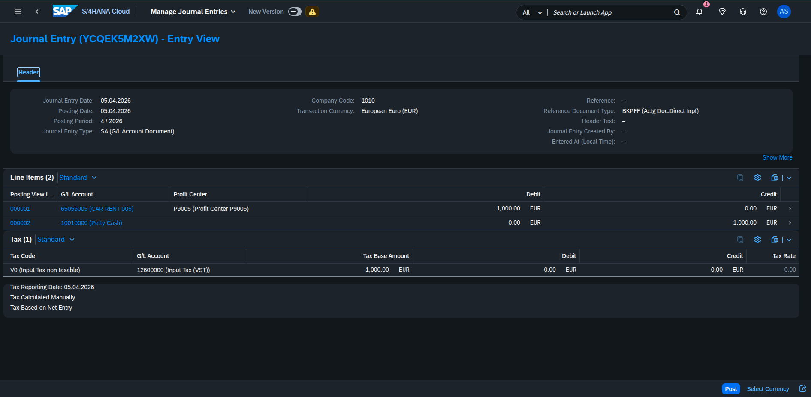

## BUSINESS PARTNER CREATION

Created a Business Partner (supplier) and maintained geneal data required for financial transectons.

## COMPANY CODE DATA

Extended the supplier to company code level and maintained reconciliation account and payment terms.

## JOURNAL ENTRY POSTING

Posted a journal entry with debit to supplier account.
Successfully posted the transection and generated document number

## POSTING SUCCESS

Verified the posted transection in the general ledger line items report.

